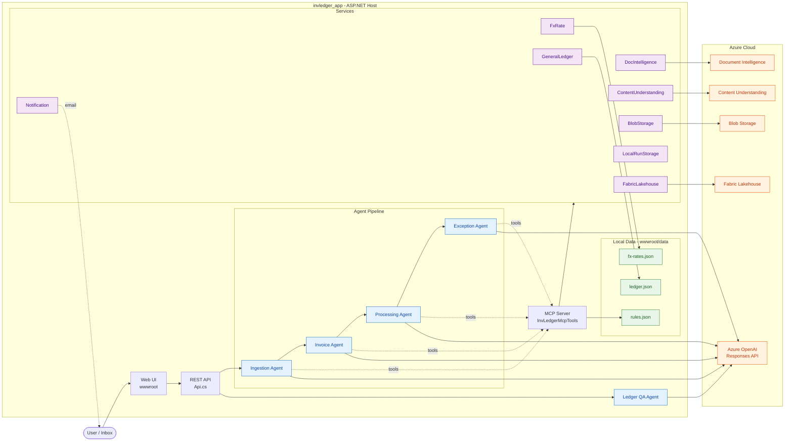
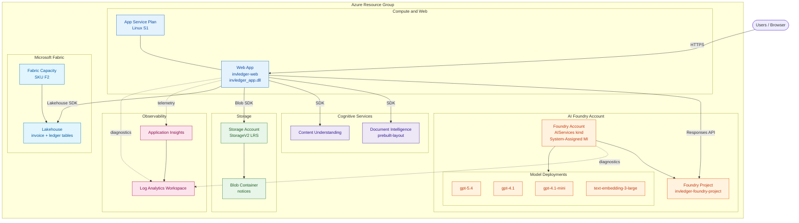
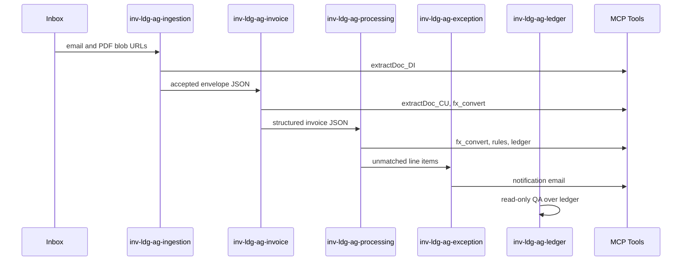

# Solution Architecture

```mermaid
flowchart LR
    User([User / Inbox])

    subgraph App[invledger_app - ASP.NET Host]
        direction TB
        UI[Web UI<br/>wwwroot]
        API[REST API<br/>Api.cs]
        UI --> API

        subgraph Pipeline[Agent Pipeline]
            direction TB
            AG1[Ingestion Agent]
            AG2[Invoice Agent]
            AG3[Processing Agent]
            AG4[Exception Agent]
            AG1 --> AG2 --> AG3 --> AG4
        end
        AG5[Ledger QA Agent]

        MCP[MCP Server<br/>InvLedgerMcpTools]

        subgraph Svc[Services]
            direction TB
            S1[DocIntelligence]
            S2[ContentUnderstanding]
            S3[FxRate]
            S4[Notification]
            S5[GeneralLedger]
            S6[BlobStorage]
            S7[LocalRunStorage]
            S8[FabricLakehouse]
        end

        subgraph LocalData[Local Data - wwwroot/data]
            direction TB
            D1[ledger.json]
            D2[rules.json]
            D3[fx-rates.json]
        end
    end

    subgraph Cloud[Azure Cloud]
        direction TB
        AOAI[Azure OpenAI<br/>Responses API]
        DI[Document Intelligence]
        CU[Content Understanding]
        BLOB[Blob Storage]
        FAB[Fabric Lakehouse]
    end

    User --> UI
    API --> AG1
    API --> AG5

    AG1 -.tools.-> MCP
    AG2 -.tools.-> MCP
    AG3 -.tools.-> MCP
    AG4 -.tools.-> MCP

    AG1 --> AOAI
    AG2 --> AOAI
    AG3 --> AOAI
    AG4 --> AOAI
    AG5 --> AOAI

    MCP --> Svc

    S1 --> DI
    S2 --> CU
    S3 --> D3
    S4 -.email.-> User
    S5 --> D1
    S6 --> BLOB
    S8 --> FAB
    MCP --> D2

    classDef agent fill:#e3f2fd,stroke:#1565c0,color:#0d47a1
    classDef azure fill:#fff3e0,stroke:#e65100,color:#bf360c
    classDef svc fill:#f3e5f5,stroke:#6a1b9a,color:#4a148c
    classDef data fill:#e8f5e9,stroke:#2e7d32,color:#1b5e20
    class AG1,AG2,AG3,AG4,AG5 agent
    class AOAI,DI,CU,BLOB,FAB azure
    class S1,S2,S3,S4,S5,S6,S7,S8 svc
    class D1,D2,D3 data
```

## Azure / Foundry / Fabric Deployment

```mermaid
flowchart TB
    subgraph RG[Azure Resource Group]
        direction TB

        subgraph Compute[Compute and Web]
            direction TB
            ASP[App Service Plan<br/>Linux S1]
            WEB[Web App<br/>invledger-web<br/>invledger_app.dll]
            ASP --- WEB
        end

        subgraph Foundry[AI Foundry Account]
            direction TB
            FH[Foundry Account<br/>AIServices kind<br/>System-Assigned MI]
            PRJ[Foundry Project<br/>invledger-foundry-project]
            subgraph Models[Model Deployments]
                direction TB
                M1[gpt-5.4]
                M2[gpt-4.1]
                M3[gpt-4.1-mini]
                M4[text-embedding-3-large]
            end
            FH --> PRJ
            FH --> Models
        end

        subgraph Cognitive[Cognitive Services]
            direction TB
            DI[Document Intelligence<br/>prebuilt-layout]
            CU[Content Understanding]
        end

        subgraph Storage[Storage]
            direction TB
            SA[Storage Account<br/>StorageV2 LRS]
            BC[Blob Container<br/>notices]
            SA --> BC
        end

        subgraph Fabric[Microsoft Fabric]
            direction TB
            FC[Fabric Capacity<br/>SKU F2]
            LH[Lakehouse<br/>invoice + ledger tables]
            FC --> LH
        end

        subgraph Obs[Observability]
            direction TB
            LAW[Log Analytics Workspace]
            AI[Application Insights]
            AI --> LAW
        end
    end

    Users([Users / Browser])
    Users -->|HTTPS| WEB

    WEB -->|Responses API| PRJ
    WEB -->|SDK| DI
    WEB -->|SDK| CU
    WEB -->|Blob SDK| SA
    WEB -->|Lakehouse SDK| LH
    WEB -.telemetry.-> AI

    FH -.diagnostics.-> LAW
    WEB -.diagnostics.-> LAW

    classDef foundry fill:#fff3e0,stroke:#e65100,color:#bf360c
    classDef cog fill:#ede7f6,stroke:#4527a0,color:#311b92
    classDef store fill:#e8f5e9,stroke:#2e7d32,color:#1b5e20
    classDef fab fill:#e1f5fe,stroke:#0277bd,color:#01579b
    classDef obs fill:#fce4ec,stroke:#ad1457,color:#880e4f
    classDef web fill:#e3f2fd,stroke:#1565c0,color:#0d47a1
    class FH,PRJ,M1,M2,M3,M4 foundry
    class DI,CU cog
    class SA,BC store
    class FC,LH fab
    class LAW,AI obs
    class ASP,WEB web
```

```mermaid
sequenceDiagram
    participant Inbox
    participant Ingestion as inv-ldg-ag-ingestion
    participant Invoice as inv-ldg-ag-invoice
    participant Processing as inv-ldg-ag-processing
    participant Exception as inv-ldg-ag-exception
    participant Ledger as inv-ldg-ag-ledger
    participant MCP as MCP Tools

    Inbox->>Ingestion: email and PDF blob URLs
    Ingestion->>MCP: extractDoc_DI
    Ingestion->>Invoice: accepted envelope JSON
    Invoice->>MCP: extractDoc_CU, fx_convert
    Invoice->>Processing: structured invoice JSON
    Processing->>MCP: fx_convert, rules, ledger
    Processing->>Exception: unmatched line items
    Exception->>MCP: notification email
    Ledger->>Ledger: read-only QA over ledger
```
